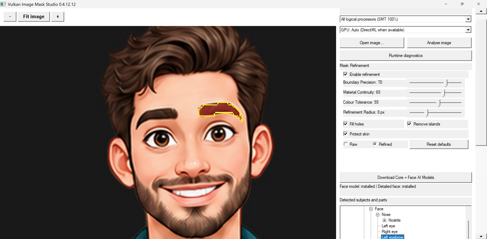

# VIMS 

The program/application abbreviation "VIMS" stands for "vulkan, image, mask, studio".



Vulkan Image Mask Studio is a desktop application for analysing still images and exporting masks of detected subjects, body regions, clothing, and scene elements. It displays the image in a Vulkan preview and runs ONNX segmentation models through ONNX Runtime. CPU analysis works without DirectML; Auto attempts DirectML when a compatible provider and GPU are available.

  

## What it does

- Opens PNG, JPEG, BMP, TIFF, and WebP images through Windows Imaging Component, subject to the codecs installed on the computer. Source images remain at full resolution for analysis; the preview fits on opening and supports bicubic zoom and drag to pan.
- Uses separate scene, human/clothing, and optional face ONNX models to construct a tree of masks. Some fine details are approximations, while missing detectors remain explicitly marked. Estimated hidden surfaces are labelled as projections, never observed image pixels.
- Exports grayscale PNG masks, optional transparent cutouts, boundary JSON, and individual connected components. Detected humans and animals can be exported as approximate 30-second, 1280 × 720 transparent pose GIFs.
- Saves rough editable mask areas in `TrainingGuides`. Users may paint mask corrections and explicitly approve them into `TrainingSamples`; a local companion learner can activate after validation against approved examples from different images. It does **not** retrain the original ONNX model on every analysis.
- Writes timing, measurement, image-property and diagnostic logs under `Logs` beside the executable.

Mask accuracy depends on the downloaded models, visibility, lighting and pose. A projected hidden mask is an estimate rather than recovered unseen detail. The 2D GIF uses approximate joints rather than a 3D rig.

## Download and run

1. Open the GitHub repository's **Releases** page and download the `VIMS_v0.4.12.12_Windows_x64.zip` asset. GitHub's automatic “Source code” archive contains source only.
2. Extract the **entire** ZIP to a writable folder. Keep the executable and DLLs together; do not run the executable inside the ZIP.
3. Run `download_models.ps1` from PowerShell inside the extracted folder to fetch the core scene and clothing models. The **Download Core + Face AI Models** button in the app is another option; optional models require network access and can take substantial space.
4. Launch `VulkanImageMaskStudio_v0.4.12.12.exe`, select **Open image...**, and then **Analyse image**. Choose an entry in **Detected subjects and parts** to preview its mask.
5. Use **Export selected mask + boundary** to choose a save path, **Export all masks** to save into `Exports`, or **Export 30-second pose GIFs** for detected subjects. A single subject prompts for a GIF path; multiple subjects go to `Exports/PoseGIFs`.

Use the + / − / Fit image controls or the mouse wheel over the preview to zoom. Drag with the left button to pan while area editing is off; middle drag pans while editing. In **Edit mask area**, drag the cyan shape to move or resize it and use its rotation handle to turn it. Shift-drag paints, Ctrl-drag erases, and Shift + wheel changes brush radius. Approve only reviewed corrections for learning.

The right panel scrolls independently of the preview. The application starts maximized. Give the app folder write access so `Exports`, `Logs`, `TrainingGuides`, `TrainingSamples`, and `LearnedModels` can be created.

## Verify the download

Download both release assets into the same folder:

- `VIMS_v0.4.12.12_Windows_x64.zip`
- `VIMS_v0.4.12.12_Windows_x64.sha256`

Open PowerShell in that folder and run:

```powershell
Get-FileHash .\VIMS_v0.4.12.12_Windows_x64.zip -Algorithm SHA256
Get-Content .\VIMS_v0.4.12.12_Windows_x64.sha256
```

Compare the hash shown by the first command with the hash in the checksum file. They must match; uppercase and lowercase letters are equivalent.

If they do not match, download both assets again before extracting or running the application.

## Requirements

- Windows 10 or 11 x64, with a Vulkan-capable GPU and current Vulkan graphics driver for the preview.
- A CPU for ONNX inference; DirectML acceleration is optional and requires a compatible DirectML-enabled ONNX Runtime and graphics driver.
- Windows Imaging Component codecs for the image type in use; WebP availability can vary by installation.
- Downloaded `.onnx` core models in `models/`. The model weights are **not** in this repository or release ZIP.

## Build from source

See [BUILDING.md](https://github.com/khant735/VIMS/blob/main/BUILDING.md). For publication steps, see [PUBLISHING.md](https://github.com/khant735/VIMS/blob/main/PUBLISHING.md). This release executable was cross-compiled with LLVM-MinGW and linked against the Vulkan loader import library; the instructions reproduce that toolchain, rather than an earlier OpenCV/vcpkg build. No downloaded model weights or local learning samples are required to compile.

## Repository and release contents

- `src/` — current C++20 implementation; one copy only.
- `download_models.ps1` and `models/README_MODEL_PACK.md` — model installer and model roles.
- `ANATOMY_TAXONOMY.json`, `MASK_TAXONOMY_v0.4.3.json` — taxonomy references.
- `BUILDING.md`, `RELEASE_NOTES.md`, `LICENSE`, `THIRD_PARTY.md` — build, changes and rights.
- GitHub **Release asset ZIP** — prebuilt `.exe`, required runtime DLLs, model downloader and user instructions. Executables, DLLs, models, logs and private training samples are not committed to the Git repository.

## Current status

Version 0.4.12.12 is a preview. It compiled and its ZIP passed an integrity check, but recent Windows UI fixes, Snipping Tool compatibility, and detection accuracy require testing on an actual Windows installation. Please report the app version, reproduction steps, a screenshot or recording, and the relevant `Logs` files when filing an issue.

## Target Render / Future changes & improvements.
https://github.com/khant735/VIMS/blob/main/e2a2e23f-e9e2-4e2f-b762-15cad8b8657a.png

## License and external components

The application source carries the [MIT license](LICENSE). Bundled runtime DLLs and optional downloaded models have separate licenses; see [THIRD_PARTY.md](THIRD_PARTY.md). Check upstream model terms before redistributing model weights.
